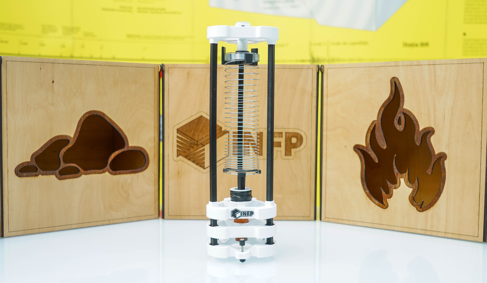
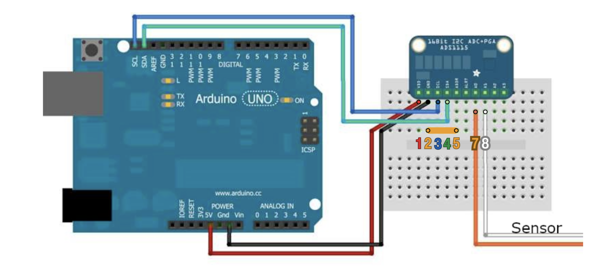

# 3D Printed Slinky Seismometer

Educational 3D printed seismometer that uses a slinky spring and a DIY coil to record mechanical vibrations. A clear and easy to understand and build demonstration for the functioning principles of a geophone.

For building your very own DIY 3d printed seismometer we recommend using the materials listed in the [List of materials](materials.md), a 3D printer and PETG filament and following the instructions below!

--------
## Table of contents
- [3D printing](#3d-printing)
- [Assembly](#assembly)
    1. [The Base](#1-the-base)
    2. [The Dampener](#2-the-dampener)
    3. [The Coil](#3-the-coil)
- [Electronics](#electronics)
- [Programming](#programming)
- [Final Construction](#final-construction)
- [Software](#software)

________
## 3D printing

In the [3D files](3d_print_objs/) folder you will find the .obj files for each component needed for the assembly of the seismometer.

The .mtl files also include the information needed for printing the seismometer in a dual color configuration, like our examples. Multi-color prints of the seismometer should not generate too much filament waste even for single toolhead multi-material printing setups. 

That being said, printing it in more than one color is not necessary. Importing each .obj into your slicer of choice and selecting a single filament color will not affect the functionality of the seismometer.

We recommend the use of PETG for its cost/benefit ratio for the application intended, but the design can also obviously be printed in any number of other materials as well.

------------

## Assembly

### 1. The Base

The base should start with the part printed from the file [BottomRing.obj](3d_print_objs/BottomRing.obj). As you will be able to see, the component presents three feet with three small holes. You should insert one M4 rivert nut into each of the holes, with the small collar of the nut staying on the underside of the part and securing it with a drop of superglue.

This base is built to hold the three adjustable feet. To achieve them you will have to print three copies of each of the following files: [FeetTip.obj](3d_print_objs/FeetTip.obj) and [FeetThumb.obj](3d_print_objs/FeetThumb.obj).

The "[FeetThumb.obj](3d_print_objs/FeetThumb.obj)" components will be used as thumbscrew attachements for the 3 M4 countersunk screws. Therefore, screw each screw into each of the printed objects until the head sinks down into the 3d printed part fully.

Then insert each of the new "thumbscrews" into one of the nuts in the base.

A very important characteristinc of our seismometer's feet are the sharp tips the feet have in order to minimise the contact surface between it and the ground it stands on. For those sharp tips, you will need to insert the three M4 threaded inserts into the "[FeetTip.obj](3d_print_objs/FeetTip.obj)" objects you have printed, by heating them up and melting them into the printed plastic (just like any other threaded insert).

Once that is done, you can screw each of the sharp tips onto each screw, and we have a completed base for our device.

### 2. The Dampener

The Dampener layer is the component that sits right above our base. It uses a copper pipe reducer to dampen oscillations of the seismometer using Eddy current.
For this, you must first print the [Dampener](3d_print_objs/DampenerRing.obj) part. The copper reduction piece must be inserted in the center of it (With the wider part upwards).
The fit is quite tight. A little superglue and light hammering can work well, but we have gotten great results with and prefer heating up the copper with a heatgun and letting it melt slightly into the part, much like a threaded insert would.

### 3. The Coil

The most complex and most important of the components is **the coil**.

After printing the [CoilRing.obj](3d_print_objs/CoilRing.obj) and [Logo.obj](3d_print_objs/Logo.obj) files, you can first superglue the logo into the designated slot in the coil.

The next step is coiling the copper 0.1 mm thick wire around the coil about 3600 times. That can be done manually, but we recommend doing so using any sort of motor that can count the number of rotations. For coiling automatically, we recommend using the [JigBobinare.obj](3d_print_objs/JigBObinare.obj) attachement to help protect the wire while spinning the CoilRing.

When coiling don't forget to leave about 10cm of both of the ends of the wire exposed outside the coil.

At this stage you should use some electrical tape to wrap around the coil to protect it, while still leaving the ends of the wire out in the open.

Using some sandpaper, lightly strip away the plastic coating from the ends of the wire.
The ends of the wire should be soldered to the exposed leads of the DC connector.

After soldering, the connector should be inserted into its hexagonal hole and secured with a drop of superglue. Also, another layer of electrical tape should be wrapped around the coild and the soldered leads.

------

## Electronics

Using a breadboard, prepare the Arduino Uno and the ADC module and connect Dupont wires between the two following the wiring scheme from the following image:

The "7 and 8" Sensor wires should connect to the two leads from the DC power connector.

-----

## Programming

Upload the code from the [Code.ino](Code.ino) file into Arduino IDE and upload it to your Arduino Uno board in order to run the device. It will require you to download the recommended libraries from the start of the files.

------

## Final Construction

Here we have uploaded a video tutorial of what the final construction of the Seismometer should look like:

____

## Software

In order to visualise the data, you must go the the following link: https://www.iris.edu/hq/jamaseis/
and download the JamaSeis software.

After installation, you will need to configure your device as a local source. It will prompt you to select the port that the seismometer is connected to (Check the COM port from device manager). Also, you must configure the device type as a TC-1 and set the offset to 32000.

Once you have chosen a name for your seismometer, you will be ready to register your first set of data!
